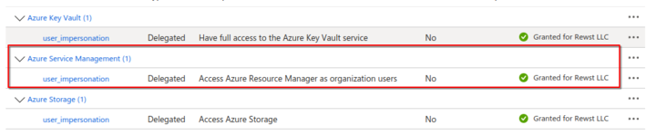
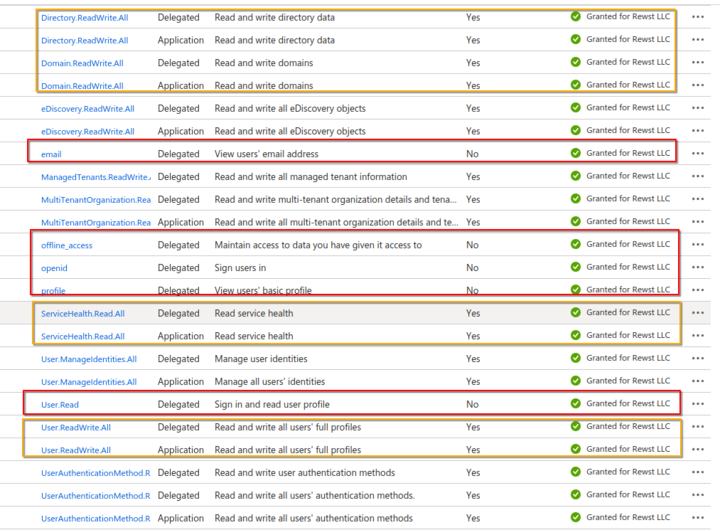
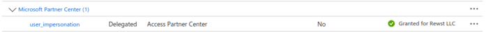
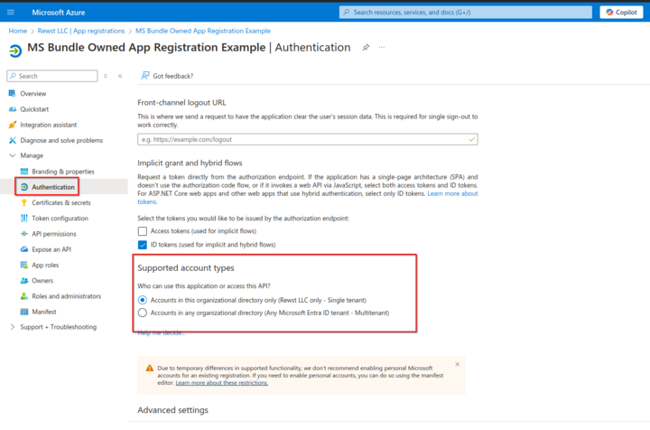
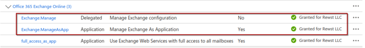

# Owned App Registration

***

## **Overview**

Owned App Registration within your Microsoft tenant allows for a tailored configuration and heightened security settings. This advanced option is **suited for users with proficiency in their Microsoft Entra environment** who require custom control over their Microsoft integrations.

## **Reasons to Choose Owned App Registration**

* **Specialized Access:** Your requirements are not natively met via Rewst's Cloud Connector.
* **Enhanced Security Control:** You need control over the application for security purposes.
* **Utilization of Existing Applications:** You wish to integrate with already existing applications.

***

## **Configuration Instructions**


Below is a high-level walkthrough of what you need to configure your owned app in Rewst. For detailed instructions and additional support on registering/managing your own apps, refer to Microsoft's[ Guide to registering an application with the Microsoft identity platform](https://learn.microsoft.com/en-us/entra/identity-platform/quickstart-register-app).


1. **Access the Azure Portal:**
   * Log into your [Microsoft Entra Admin Center](https://entra.microsoft.com/).
   * Navigate to **Identity** -> **Applications** -> **App Registrations**.
2. **Create or Select an App Registration:**
   * To create a new app, click **New registration**.
   * To use an existing app, select one from the **Owned applications** list.
3. **Configure Redirect URL:**
   * To ensure Rewst can communicate with your app registration after authentication, and receive security tokens post-authentication, set the redirect URI to `https://engine.rewst.io/integrations/bundles/microsoft_cloud/callback`
4. **Gather Essential Information:**
   * Note the **Client ID** & Generate a **Client Secret** under **Certificates & secrets**.
   * Enter these credentials when configuring the application in Rewst.
5. **Decide the Auth Subject:**
   * Select **common** if your app registration is accessible across multiple tenants.
   * Choose **Tenant ID** if your registration is restricted to your own tenant, and ensure this ID is included in the **Tenant ID** field to generate the correct authentication URL.

***

## **Minimum Permissions Needed**

### Azure Integration

In order to use the Azure Integration, you will need the following at minimum:&#x20;

<figure><figcaption></figcaption></figure>


Depending on the use-case, you may require the other two shown above.&#x20;


### Microsoft Graph Integration

In order to use the Graph Integration, you'll need the following highlighted in red at minimum to authorize the integration. The following highlighted in yellow are also highly recommended to ensure all expected actions work:&#x20;

<figure><figcaption></figcaption></figure>

### Microsoft Graph Subscription Triggers&#x20;

In order to use the Microsoft Graph Subscription Triggers, the following permissions are required:&#x20;

<figure><figcaption></figcaption></figure>

### CSP Integration

There is only one permission required to use the CSP integration:

<figure><figcaption></figcaption></figure>


When choosing the Auth Subject:

* If you're not using a CSP: Select **common** so that you are only exposing your app to your own tenant
* If you are using a CSP: Choose **Tenant ID** as it's the subject used for mult-tenancy when constructing an auth URL. This will install an enterprise app in the CSP customer tenants and you will be able to run actions for customers.&#x20;


<figure><figcaption></figcaption></figure>

### EXO Integration

In order to use the EXO Integration, the highlighted permissions are required:

<figure><figcaption></figcaption></figure>


The `full_access_as_app` permission is also recommended in some edge cases.

